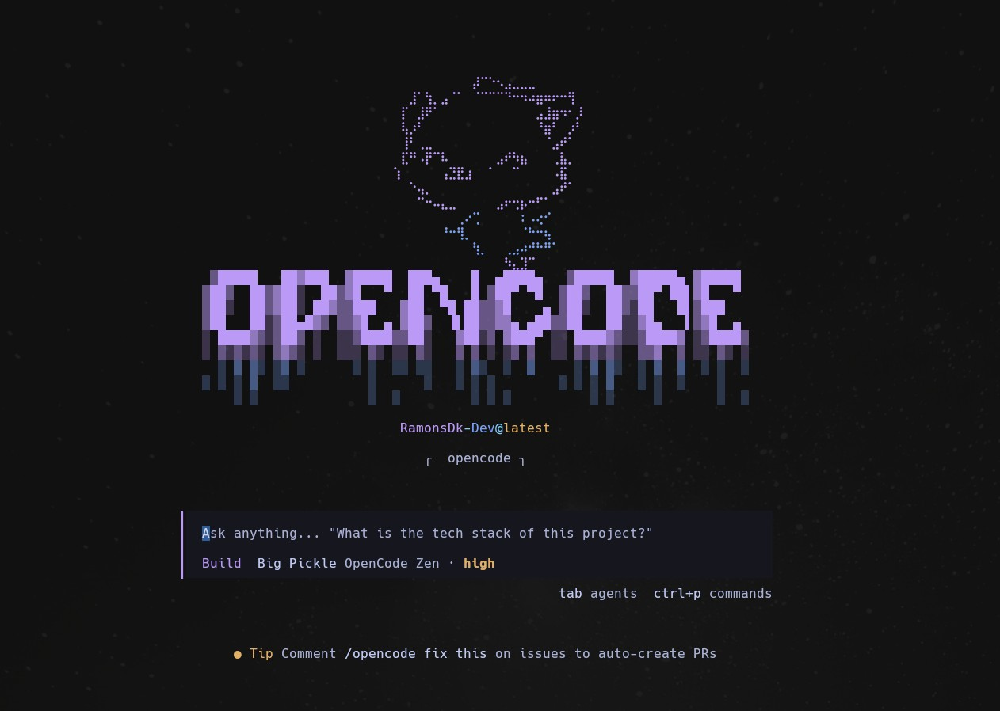
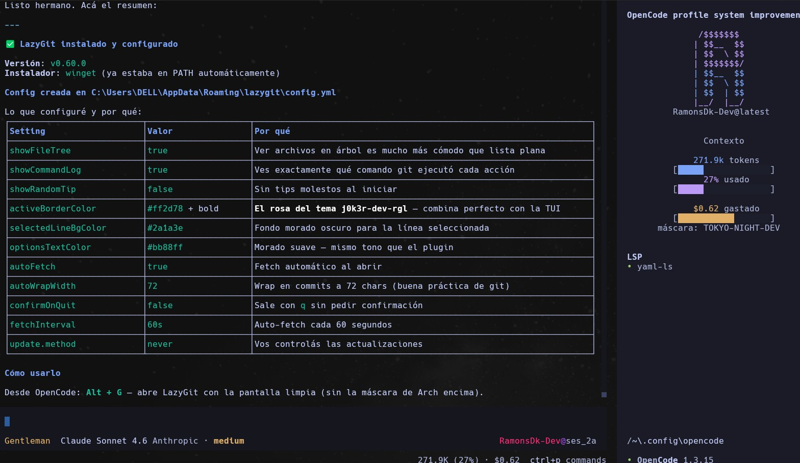
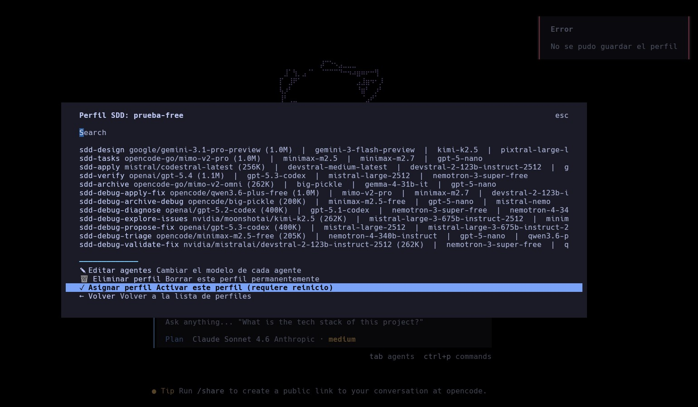

# 🎩 OpenCode — Full Config Gentleman Edition

> **El setup más completo de OpenCode que vas a encontrar.**  
> Arquitectura multi-agente con SDD, enrutamiento inteligente de modelos, TUI personalizada con 8 temas, motor de fallbacks de 3 niveles, memoria persistente entre sesiones y un sistema de perfiles gráfico completo.

---



---

 ## ANTES DE EMPEZAR (MUY IMPORTANTE) ⚠️

Nada de esto hubiera sido posible sin el trabajo del gran desarrollador Alan Buscaglia.
Gran parte de este setup está inspirado en sus proyectos, especialmente en su enfoque y herramientas.

*Si este proyecto te aporta valor, te recomiendo pasar por su trabajo y apoyarlo* 👇

💻 **Proyectos**

*GitHub:* https://github.com/Gentleman-Programming

*Gentle-AI:* https://github.com/Gentleman-Programming/gentle-ai

🎥 **Redes**

*Twitch: https:* //www.twitch.tv/gentleman_programming

*YouTube: https:* //www.youtube.com/c/GentlemanProgramming

*Canal secundario (VODs):* https://www.youtube.com/channel/UCIscmdXDtypp2zTzEEYxJwg

*Kick:* https://kick.com/gentleman-programming

💬 **Comunidad**

*Discord:* https://discord.com/invite/3QVhF5vRsR

💡 **Apoyar a los creadores que aportan valor a la comunidad es clave para que este tipo de proyectos sigan creciendo.**
---

## 📋 Tabla de Contenidos

1. [¿Qué incluye este setup?](#-qué-incluye-este-setup)
2. [Estructura del directorio](#-estructura-del-directorio)
3. [El Agente Gentleman — AGENTS.md](#-el-agente-gentleman--agentsmd)
4. [Sistema de Agentes — opencode.json](#-sistema-de-agentes--opencodejson)
5. [Motor de Fallbacks](#-motor-de-fallbacks)
6. [Gentle SDD Router (GSR)](#-gentle-sdd-router-gsr)
7. [Flujo SDD completo — Comandos de chat](#-flujo-sdd-completo--comandos-de-chat)
8. [Sub-perfiles SDD — sdd-models.jsonc](#-sub-perfiles-sdd--sdd-modelsjsonc)
9. [Plugin TUI — Arch Mask OpenCode](#-plugin-tui--arch-mask-opencode)
10. [Sistema de Perfiles Gráfico](#-sistema-de-perfiles-gráfico)
11. [Temas visuales — 8 esquemas de color](#-temas-visuales--8-esquemas-de-color)
12. [Atajos de teclado personalizados](#️-atajos-de-teclado-personalizados)
13. [Integración LazyGit](#-integración-lazygit)
14. [MCPs integrados — Context7 y Engram](#-mcps-integrados--context7-y-engram)
15. [Plugins de autenticación](#-plugins-de-autenticación)
16. [Provider Qwen personalizado](#-provider-qwen-personalizado)
17. [Sistema de permisos (bash/read)](#-sistema-de-permisos-bashread)
18. [Correcciones y modificaciones realizadas](#-correcciones-y-modificaciones-realizadas)
19. [Guía de instalación paso a paso](#-guía-de-instalación-paso-a-paso)

---

## 🌟 ¿Qué incluye este setup?

Este repositorio documenta y describe el entorno de OpenCode más completo para desarrollo profesional. No es solo un `opencode.json` con modelos — es una **arquitectura completa** construida con capas:

| Capa | Qué hace |
|------|----------|
| 🎩 **Gentleman Agent** | Mentor de arquitectura de software con personalidad definida, reglas estrictas y filosofía de enseñanza |
| 🤖 **SDD Pipeline** | 9 sub-agentes ocultos (Explore → Propose → Spec → Design → Tasks → Apply → Verify → Archive) coordinados por un Orchestrator |
| 🐛 **SDD Debug Pipeline** | 7 sub-agentes especializados en debugging sistemático |
| ⚡ **GSR** | Motor de enrutamiento de modelos con 3 presets (free/mixto/premium) y fallbacks en cascada |
| 💾 **Sistema de Perfiles** | TUI gráfica para crear, editar y activar perfiles completos de configuración |
| 🎨 **Arch Mask TUI** | Plugin visual con 8 temas, integración LazyGit, atajos y ventana de diálogo grande para visualizar todos los agentes SDD |
| 🧠 **Engram** | Memoria persistente entre sesiones via MCP |
| 📚 **Context7** | Documentación actualizada de librerías vía MCP |
| 🔐 **Permisos** | Sistema de permisos granular para bash y lectura de archivos |

---



---

## 📁 Estructura del directorio

Todo vive en `~/.config/opencode/` (Windows: `C:\Users\TU_USUARIO\.config\opencode\`).

```
~/.config/opencode/
│
├── 📄 opencode.json              ← Config principal: agentes, MCPs, plugins, permisos, providers
├── 📄 tui.json                   ← Registro del plugin TUI (arch-mask-opencode)
├── 📄 AGENTS.md                  ← Personalidad, reglas, filosofía y protocolo Engram del Gentleman
│
├── 🎨 arch-mask-opencode/        ← Plugin TUI completo (TypeScript/TSX)
│   ├── tui.tsx                   ← Motor principal: temas, atajos, gestor de perfiles
│   ├── components.tsx            ← Componentes visuales (logo, sidebar, detección de env)
│   ├── config.ts                 ← Tipado y parseo de configuración del plugin
│   ├── detection.ts              ← Detección de OS, providers y entorno
│   ├── package.json              ← Dependencias del plugin
│   └── themes/                   ← 8 archivos JSON de temas de color
│       ├── j0k3r-dev-rgl.json    ← 🌸 Rosa/morado (default)
│       ├── arch-cyber.json       ← 🟢 Verde matrix
│       ├── arch-neon.json        ← 🔵 Cian brillante
│       ├── arch-overclock.json   ← 🔴 Rojo agresivo
│       ├── mask-cyber.json       ← ⚫ Cyber oscuro
│       ├── tokyo-night-dev.json  ← 💙 Azul tokio
│       ├── arch-electric.json    ← ⚡ Amarillo eléctrico
│       └── j0k3r-neon.json       ← 🟣 Neon púrpura
│
├── ⚙️ router/                    ← Configuración de GSR (Gentle SDD Router)
│   ├── router.yaml               ← Estado global de GSR y preset activo
│   ├── profiles/                 ← 5 presets YAML de enrutamiento
│   │   ├── free.router.yaml
│   │   ├── mixto.router.yaml     ← PRESET ACTIVO
│   │   ├── premium.router.yaml
│   │   ├── sdd-debug-mono.router.yaml
│   │   └── sdd-debug-multi.router.yaml
│   └── catalogs/                 ← Contratos de workflow para agentes de debug
│       └── sdd-debug/
│           ├── sdd.yaml
│           └── contracts/
│               ├── phases/       ← Contratos de cada fase de debugging
│               └── roles/        ← Contratos de cada rol en debugging
│
├── 💾 profiles/                  ← Snapshots JSON de perfiles guardados por el usuario
│   ├── pprueba2.json
│   └── prueba-free.json
│
├── 🧠 .opencode/
│   └── sdd-models.jsonc          ← Sub-perfiles de modelos SDD (balancedo/economico/profesional)
│
├── 🔌 plugins/
│   ├── background-agents.ts      ← Plugin de agentes en background
│   └── engram.ts                 ← Configuración MCP de Engram
│
├── 📚 skills/                    ← +120 archivos .md de instrucciones para cada sub-agente
│   ├── sdd-init/SKILL.md
│   ├── sdd-explore/SKILL.md
│   ├── ... (9 skills SDD + 120+ skills de la comunidad)
│
└── 💬 commands/                  ← Comandos de chat (/comando)
    ├── sdd-new.md
    ├── sdd-init.md
    ├── sdd-explore.md
    ├── sdd-apply.md
    ├── sdd-verify.md
    ├── sdd-archive.md
    ├── sdd-continue.md
    ├── sdd-onboard.md
    └── sdd-ff.md
```

> ⚠️ **IMPORTANTE para quien instale esto**: Las rutas absolutas en `tui.json` y en los prompts de los agentes `sdd-debug-*` dentro de `opencode.json` contienen `DELL` (nombre del usuario original). **Deberás reemplazar `DELL` por tu nombre de usuario.** Al final de esta guía hay un script para hacerlo automáticamente.

---

## 🎩 El Agente Gentleman — AGENTS.md

El corazón de este setup es el agente `gentleman` — un Senior Architect con 15+ años de experiencia, GDE y MVP, que actúa como mentor apasionado. Su comportamiento está completamente definido en `AGENTS.md` y se inyecta como prompt en todos los agentes principales.

### Reglas de comportamiento

```markdown
- Nunca agrega "Co-Authored-By" ni atribución AI en commits
- Nunca compila/buildea después de cambios
- Cuando el usuario afirma algo: "dejame verificar" → chequea el código/docs primero
- Si el usuario está equivocado: explica POR QUÉ con razonamiento técnico
- Propone siempre alternativas con tradeoffs
- Nunca continúa asumiendo respuestas — pregunta y espera
```

### Personalidad y lenguaje

| Input del usuario | Respuesta del agente |
|-------------------|----------------------|
| Español | Rioplatense con voseo: "dale", "loco", "locura cósmica", "buenísimo", "ponete las pilas" |
| English | Warm energy: "here's the thing", "fantastic", "dude", "let me be real", "seriously?" |

### Filosofía

- **CONCEPTOS > CÓDIGO**: No genera código sin que se entiendan los fundamentos
- **AI ES UNA HERRAMIENTA**: El humano dirige, la IA ejecuta
- **FUNDAMENTOS SÓLIDOS**: Patrones de diseño y arquitectura antes que frameworks
- **CONTRA LA INMEDIATEZ**: No hay atajos — el aprendizaje real requiere esfuerzo

### Expertise declarado

Frontend (Angular, React), state management (Redux, Signals, GPX-Store), Clean/Hexagonal/Screaming Architecture, TypeScript, testing, atomic design, container-presentational pattern, LazyVim, Tmux, Zellij.

### Protocolo Engram (memoria persistente integrada)

El `AGENTS.md` incluye un protocolo completo que instruye al agente a **guardar automáticamente** en Engram después de:

- Tomar una decisión de arquitectura
- Corregir un bug (con causa raíz)
- Establecer una convención de equipo
- Descubrir algo no obvio sobre el codebase
- Aprender una preferencia del usuario

El agente también **busca en memoria** automáticamente al inicio de sesión, en referencias a trabajo anterior y en preguntas de tipo "recordás cuando...".

### Cómo usar el AGENTS.md

Copiá el archivo a la raíz de tu `.config/opencode/`. Se referencia automáticamente desde `opencode.json`:

```json
"gentleman": {
  "prompt": "{file:./AGENTS.md}"
}
```

---

## 🤖 Sistema de Agentes — opencode.json

La configuración completa de todos los agentes está en `opencode.json`. Hay **tres categorías**:

### Agentes visibles en Tab (`mode: primary`, `hidden: false`)

Estos aparecen cuando presionás `Tab` en OpenCode:

| Agente | Modelo Principal | Propósito |
|--------|-----------------|-----------|
| `gentleman` | `opencode/big-pickle` | Mentor arquitecto — chat general, code review, enseñanza |
| `sdd-orchestrator` | `anthropic/claude-sonnet-4-6` | Coordina el pipeline SDD sin escribir código él mismo |
| `gsr-free` | `mistral/mistral-large-3` | Preset full free-tier, ideal para uso diario sin costo |
| `gsr-mixto` | `openai/gpt-5.3-instant` | Preset equilibrado costo/rendimiento |
| `gsr-premium` | `anthropic/claude-sonnet-4-6` | Preset premium para tareas de arquitectura crítica |

Más los nativos de OpenCode: `Build` y `Plan`.

### Sub-agentes SDD ocultos (`mode: subagent`, `hidden: true`)

Invisibles en la UI — son invocados automáticamente por `sdd-orchestrator` via el sistema de `delegate`:

| Agente | Modelo Principal | Rol en el pipeline |
|--------|-----------------|---------------------|
| `sdd-init` | `opencode-go/kimi-k2.5` | Bootstrapea el contexto SDD del proyecto |
| `sdd-onboard` | `opencode/big-pickle` | Guía al usuario en su primer ciclo SDD |
| `sdd-explore` | `mistral/mistral-large-2512` | Investiga el código existente |
| `sdd-propose` | `openai/gpt-5.4` | Crea la propuesta de cambio |
| `sdd-spec` | `mistral/devstral-medium-latest` | Escribe las especificaciones técnicas |
| `sdd-design` | `google/gemini-3.1-pro-preview` | Define la arquitectura detallada |
| `sdd-tasks` | `opencode-go/mimo-v2-pro` | Desglosa en tareas ejecutables |
| `sdd-apply` | `mistral/codestral-latest` | Escribe el código real |
| `sdd-verify` | `openai/gpt-5.4` | Valida que la implementación cumple las specs |
| `sdd-archive` | `opencode-go/mimo-v2-omni` | Archiva y documenta el ciclo completado |

### Sub-agentes SDD Debug (`mode: subagent`, `hidden: true`)

Se activan automáticamente cuando `sdd-verify` detecta issues:

| Agente | Modelo Principal |
|--------|-----------------|
| `sdd-debug-explore-issues` | `nvidia/moonshotai/kimi-k2.5` |
| `sdd-debug-triage` | `opencode/minimax-m2.5-free` |
| `sdd-debug-diagnose` | `openai/gpt-5.2-codex` |
| `sdd-debug-propose-fix` | `openai/gpt-5.3-codex` |
| `sdd-debug-apply-fix` | `opencode/qwen3.6-plus-free` |
| `sdd-debug-validate-fix` | `nvidia/mistralai/devstral-2-123b-instruct-2512` |
| `sdd-debug-archive-debug` | `opencode/big-pickle` |

---

## 🔄 Motor de Fallbacks

**Cada agente tiene hasta 3 modelos de respaldo.** Si el primario falla (API caída, rate limit, timeout), el sistema cae automáticamente al siguiente — en milisegundos, de forma transparente.

### Tabla completa de fallbacks

| Agente | Primario | Fallback 1 | Fallback 2 | Fallback 3 |
|--------|----------|------------|------------|------------|
| `gentleman` | `opencode/big-pickle` | `mistral/mistral-large-2512` | — | — |
| `sdd-orchestrator` | `anthropic/claude-sonnet-4-6` | `google/gemini-3.1-pro-preview` | `openai/gpt-5.4` | `opencode-go/mimo-v2-pro` |
| `sdd-init` | `opencode-go/kimi-k2.5` | `opencode/qwen3.6-plus-free` | `nvidia/kimi-k2.5` | `kimi-k2-instruct-0905` |
| `sdd-onboard` | `opencode/big-pickle` | `opencode/gpt-5-nano` | `minimax-m2.5-free` | `kimi-k2-instruct` |
| `sdd-explore` | `mistral/mistral-large-2512` | `nvidia/mistral-large-3-675b` | `mistral-medium-2508` | `nemotron-3-super-free` |
| `sdd-propose` | `openai/gpt-5.4` | `opencode-go/glm-5` | `mistral-large-2512` | `mimo-v2-pro` |
| `sdd-spec` | `mistral/devstral-medium-latest` | `nvidia/devstral-2-123b` | `nvidia/glm5` | `opencode/gpt-5-nano` |
| `sdd-design` | `google/gemini-3.1-pro-preview` | `gemini-3-flash-preview` | `kimi-k2.5` | `pixtral-large-latest` |
| `sdd-tasks` | `opencode-go/mimo-v2-pro` | `minimax-m2.5` | `minimax-m2.7` | `opencode/gpt-5-nano` |
| `sdd-apply` | `mistral/codestral-latest` | `devstral-medium-latest` | `nvidia/devstral-2-123b` | `gpt-5.3-codex-spark` |
| `sdd-verify` | `openai/gpt-5.4` | `gpt-5.3-codex` | `mistral-large-2512` | `nemotron-3-super-free` |
| `sdd-archive` | `opencode-go/mimo-v2-omni` | `opencode/big-pickle` | `nvidia/gemma-4-31b-it` | `opencode/gpt-5-nano` |
| `gsr-free` | `mistral/mistral-large-3` | `qwen3.6-plus-free` | `glm-5` | `mimo-v2-pro` |
| `gsr-mixto` | `openai/gpt-5.3-instant` | `mistral-large-3` | `glm-5` | `qwen3.6-plus-free` |
| `gsr-premium` | `anthropic/claude-sonnet-4-6` | `gpt-5.3-instant` | `mistral-large-3` | `glm-5` |

### Cómo configurar fallbacks

```json
"sdd-apply": {
  "model": "mistral/codestral-latest",
  "fallback": "mistral/devstral-medium-latest, nvidia/mistralai/devstral-2-123b-instruct-2512, openai/gpt-5.3-codex-spark"
}
```

La key `fallback` acepta una lista separada por coma. **El orden importa** — mayor prioridad el primero.

---



---

## ⚡ Gentle SDD Router (GSR)

GSR es un enrutador externo que gestiona qué modelo sirve cada fase del pipeline SDD. Vive en `router/` y tiene su propio CLI.

### Presets disponibles

#### 🟢 Preset `free` — Solo modelos gratuitos

Para uso cotidiano sin costos. Todos los modelos son free-tier.

| Fase | Modelo principal | Fallbacks |
|------|-----------------|-----------|
| Orchestrator | `mistral/mistral-large-3` | qwen3.6-plus-free, glm-5, mimo-v2-pro |
| Explore | `mistral/mixtral-8x22b` | mistral-large-3, nemotron-3-super-free, qwen3.6 |
| Propose | `mistral/mistral-large-3` | glm-5, qwen3.6-plus-free, mixtral-8x22b |
| Spec | `mistral/devstral-medium` | glm-5, mistral-medium-3.1, mimo-v2-pro |
| Design | `opencode-go/kimi-k2.5` | pixtral-large-latest, pixtral-12b, qwen3.6 |
| Tasks | `opencode-go/minimax-m2.5` | nemotron-3-super-free, mistral-nemo, ministral-8b |
| Apply | `mistral/codestral-latest` | devstral-2-latest, qwen3.6-plus-free, mistral-nemo |
| Verify | `mistral/codestral-latest` | mistral-large-3, nemotron-3-super-free, qwen3.6 |
| Archive | `opencode-go/mimo-v2-omni` | big-pickle, opencode-zen, mistral-nemo |

#### 🟡 Preset `mixto` — Punto dulce (ACTIVO por defecto)

El mejor equilibrio entre costo y calidad.

| Fase | Modelo principal | Fallbacks |
|------|-----------------|-----------|
| Orchestrator | `openai/gpt-5.3-instant` | mistral-large-3, glm-5, qwen3.6-plus-free |
| Explore | `mistral/mistral-large-3` | mixtral-8x22b, glm-5, nemotron-3-super-free |
| Propose | `openai/gpt-5.4-thinking` | mistral-large-3, glm-5, qwen3.6-plus-free |
| Spec | `mistral/devstral-medium` | glm-5, mistral-medium-3.1, mimo-v2-pro |
| Design | `opencode-go/kimi-k2.5` | pixtral-large-latest, gpt-5.3-instant, qwen3.6 |
| Tasks | `opencode-go/minimax-m2.5` | mistral-nemo, nemotron-3-super-free, ministral-8b |
| Apply | `mistral/codestral-latest` | devstral-2-latest, kimi-k2.5, qwen3.6 |
| Verify | `openai/gpt-5.3-instant` | mistral-large-3, codestral-latest, nemotron |
| Archive | `opencode-go/mimo-v2-omni` | big-pickle, opencode-zen, mistral-nemo |

#### 🔴 Preset `premium` — Toda la artillería

Para tareas críticas de arquitectura donde la calidad es lo primero.

| Fase | Modelo principal | Fallbacks |
|------|-----------------|-----------|
| Orchestrator | `anthropic/claude-sonnet-4-6` | gpt-5.3-instant, mistral-large-3, glm-5 |
| Explore | `opencode-go/glm-5` | mistral-large-3, mixtral-8x22b, minimax-m2.5 |
| Propose | `openai/gpt-5.4-thinking` | gpt-5.3-instant, mistral-large-3, glm-5 |
| Spec | `openai/gpt-5.3-instant` | devstral-medium, glm-5, mistral-medium-3.1 |
| Design | `google/gemini-3.1-pro` | kimi-k2.5, pixtral-large-latest, gpt-5.4-thinking |
| Tasks | `google/gemini-3-flash` | minimax-m2.5, mimo-v2-pro, mistral-nemo |
| Apply | `mistral/codestral-latest` | devstral-2-latest, gpt-5.3-instant, kimi-k2.5 |
| Verify | `openai/gpt-5.4-thinking` | gpt-5.3-instant, codestral-latest, mistral-large-3 |
| Archive | `opencode-go/mimo-v2-omni` | big-pickle, opencode-zen, mistral-nemo |

### Comandos CLI de GSR

```bash
# Ver estado del router
gsr status
gsr status --verbose       # Con rutas, precios y grafo SDD

# Cambiar preset activo (sin reiniciar OpenCode)
gsr route use free
gsr route use mixto
gsr route use premium

# Ver las rutas resueltas del preset actual
gsr route show

# Listar todos los presets disponibles
gsr preset list

# Comparar dos presets
gsr inspect compare free premium

# Sincronizar cambios al opencode.json
gsr sync

# Regenerar agentes gsr-* en opencode.json
gsr apply opencode --apply

# Crear un preset nuevo
gsr preset create mi-preset

# Exportar un preset para compartir
gsr preset export mixto
```

### Estado de router.yaml

```yaml
version: 5
active_sdd: agent-orchestrator
active_preset: mixto          # ← Cambiar aquí o con "gsr route use"
activation_state: active
persona: gentleman
sdds:
  agent-orchestrator:
    displayName: SDD-Orchestrator
    enabled: true
    active_preset: mixto
  sdd-debug:
    displayName: SDD-Debug
    enabled: true
```

### Instalación de GSR

```bash
npm install -g gentle-sdd-router
gsr --version
gsr status
```

> ⚠️ **Bug conocido en GSR v0.1.0**: `gsr apply opencode --apply` lista los agentes a agregar pero puede no escribirlos en `opencode.json`. Si eso ocurre, copialos manualmente desde la salida del comando.

---

## 💬 Flujo SDD completo — Comandos de chat

El directorio `commands/` contiene instrucciones para invocar cada fase del pipeline con `/comando`:

| Comando | Qué hace |
|---------|----------|
| `/sdd-new` | Inicia un ciclo SDD nuevo desde cero |
| `/sdd-init` | Bootstrapea el contexto SDD en el proyecto actual |
| `/sdd-explore` | Activa solo la fase de exploración |
| `/sdd-apply` | Ejecuta solo la fase de implementación |
| `/sdd-verify` | Ejecuta solo la fase de verificación |
| `/sdd-archive` | Archiva el ciclo actual |
| `/sdd-continue` | Retoma un ciclo SDD pausado |
| `/sdd-onboard` | Onboarding guiado para nuevos proyectos |
| `/sdd-ff` | Fast-forward: ejecuta todo el pipeline de una sola vez |

### Flujo típico de trabajo

```
1. Tab → sdd-orchestrator
2. "Quiero agregar autenticación JWT"

   sdd-orchestrator (Orchestrator) — NEVER escribe código inline
        ↓ delegate
   sdd-explore   → Investiga el código existente y la estructura del proyecto
        ↓ resultado
   sdd-propose   → Propone el plan de implementación con alcance definido
        ↓ propuesta aprobada
   sdd-spec      → Escribe especificaciones técnicas detalladas
        ↓ specs
   sdd-design    → Define arquitectura: clases, interfaces, flujos de datos
        ↓ diseño
   sdd-tasks     → Desglosa en tareas pequeñas y ejecutables
        ↓ lista de tareas
   sdd-apply     → Escribe el código exacto tarea por tarea
        ↓ implementación
   sdd-verify    → Valida contra specs. Si hay issues → dispara sdd-debug-*
        ↓ verificación ok
   sdd-archive   → Documenta el ciclo y actualiza el estado del proyecto

3. Vos revisás y aprobás cada entrega
```

---

## 📊 Sub-perfiles SDD — sdd-models.jsonc

Además del sistema de perfiles completo, hay un sub-sistema específico para controlar qué modelo usa cada agente SDD sin cambiar el resto. Vive en `.opencode/sdd-models.jsonc`.

**Perfil activo actual**: `profesional`

| Agente | `balancedo` | `economico` | `profesional` ✓ |
|--------|-------------|-------------|-----------------|
| sdd-orchestrator | mistral-large-2512 | mimo-v2-omni-pro | **claude-sonnet-4-6** |
| sdd-init | kimi-k2.5 | kimi-k2.5 | kimi-k2.5 |
| sdd-explore | mistral-large-2512 | mistral-large-2512 | mistral-large-2512 |
| sdd-propose | mistral-large-2512 | mistral-large-2512 | **gpt-5.4** |
| sdd-spec | glm-5 | glm-5 | glm-5 |
| sdd-design | claude-sonnet-4-6 | claude-sonnet-4-6 | **gemini-3.1-pro-preview** |
| sdd-tasks | gemini-3-flash | gemini-3-flash | gemini-3-flash |
| sdd-apply | codestral-latest | codestral-latest | codestral-latest |
| sdd-verify | nemotron-3-super-free | nemotron-3-super-free | mistral-large-2512 |
| sdd-archive | mimo-v2-omni-free | mimo-v2-omni-free | mimo-v2-omni-free |

---

## 🎨 Plugin TUI — Arch Mask OpenCode

Transforma la TUI de OpenCode con estética cyber/neon y agrega funcionalidades que el cliente oficial no tiene.

### Registro en tui.json

```json
{
  "$schema": "https://opencode.ai/tui.json",
  "plugin": [
    [
      "C:\\Users\\TU_USUARIO\\.config\\opencode\\arch-mask-opencode",
      {
        "enabled": true,
        "theme": "j0k3r-dev-rgl",
        "set_theme": true,
        "show_detected": false,
        "show_os": false,
        "show_providers": false,
        "show_sidebar": true
      }
    ]
  ]
}
```

### Opciones de configuración

| Opción | Tipo | Valor actual | Descripción |
|--------|------|-------------|-------------|
| `enabled` | bool | `true` | Activa/desactiva el plugin completo |
| `theme` | string | `"j0k3r-dev-rgl"` | Tema por defecto al iniciar |
| `set_theme` | bool | `true` | Aplica el tema automáticamente al iniciar |
| `show_detected` | bool | `false` | Muestra la línea de entorno detectado |
| `show_os` | bool | `false` | Muestra el nombre del OS |
| `show_providers` | bool | `false` | Muestra los providers de IA detectados |
| `show_sidebar` | bool | `true` | Muestra el panel lateral personalizado |

> 💡 Tenemos `show_detected`, `show_os` y `show_providers` en `false` para mantener la pantalla limpia. Solo el sidebar está activo para no saturar la UI.

### Instalación del plugin

```bash
# Copiar la carpeta al config de opencode
cp -r arch-mask-opencode ~/.config/opencode/

# Instalar dependencias del plugin
cd ~/.config/opencode/arch-mask-opencode
npm install
```

---

## 💾 Sistema de Perfiles Gráfico

Una de las funcionalidades más avanzadas. Gestión visual completa de configuraciones — sin tocar JSON.

### Cómo abrir: `Alt + P`

### Menú principal

```
Gestión de Perfiles — Activo: ✓ pprueba2
─────────────────────────────────────────────
  Crear perfil
  Asignar perfil General
  Asignar perfil SDD
  ⚡ Presets GSR  [mixto]
  ✕ Cerrar
```

### Vista de detalle de un perfil (ventana XL)

Una de las modificaciones clave fue **hacer la ventana de diálogo más grande** (`xlarge`) para que se puedan ver todos los agentes SDD sin cortar. Con el tamaño default, los 10+ agentes SDD no entraban en pantalla.

```
Perfil SDD: pprueba2                              esc
─────────────────────────────────────────────────────
Perfil
  ✏ Nombre: pprueba2

Agentes
  sdd-orchestrator   anthropic/claude-sonnet-4-6 (1M)  | gemini-3.1-pro  | gpt-5.4  | mimo-v2-pro
  sdd-init           opencode-go/kimi-k2.5 (262K)      | qwen3.6-plus    | kimi-k2.5| kimi-k2-instruct
  sdd-onboard        opencode/big-pickle (200K)         | gpt-5-nano      | minimax  | kimi-k2-instruct
  sdd-explore        mistral/mistral-large-2512 (262K)  | large-3-675b    | med-2508 | nemotron-3
  sdd-propose        openai/gpt-5.4 (1.1M)             | glm-5           | large-2512| mimo-v2-pro
  sdd-spec           mistral/devstral-medium (262K)     | devstral-2-123b | glm5     | gpt-5-nano
  sdd-design         google/gemini-3.1-pro (1.0M)       | gemini-3-flash  | kimi-k2.5| pixtral-large
  sdd-tasks          opencode-go/mimo-v2-pro (1.0M)     | minimax-m2.5    | minimax-m2.7 | gpt-5-nano
  sdd-apply          mistral/codestral-latest (256K)    | devstral-medium | devstral-2-123b | gpt-5.3
  sdd-verify         openai/gpt-5.4 (1.1M)             | gpt-5.3-codex   | large-2512 | nemotron-3
  sdd-archive        opencode-go/mimo-v2-omni (262K)    | big-pickle      | gemma-4-31b | gpt-5-nano
─────────────────────────────────────────────────────
  ✎ Editar agentes
  🗑 Eliminar perfil
  ✓ Asignar perfil     (requiere reinicio)
  ← Volver
```

### Editor de agentes + Gestor de Fallbacks

Al editar un agente:
1. Elegís el **provider** (Anthropic, OpenAI, Mistral, Google, etc.)
2. Elegís el **modelo** con info de contexto (`128K`, `1M`, etc.)
3. Se abre el **Gestor de Fallbacks gráfico** con 3 slots:
   ```
   Fallbacks: sdd-apply
   Primario: mistral/codestral-latest (256K)
   ─────────────────────────────────
   FB1: mistral/devstral-medium-latest (262K)
   FB2: nvidia/devstral-2-123b (256K)
   FB3: openai/gpt-5.3-codex (400K)
   ─────────────────────────────────
   ✓ Listo — volver al editor
   ```

### Sección ⚡ Presets GSR integrada

Al entrar a "⚡ Presets GSR":
```
Presets GSR
─────────────────────────────────
✓ mixto     ACTIVO — complejidad: medium | stable
  free      complejidad: low | stable
  premium   complejidad: high | stable
← Volver
```

Seleccionar un preset:
1. Actualiza `router/router.yaml` → `active_preset: free`
2. Toast informativo: *"Usá Tab → gsr-free para el agente de esta sesión"*
3. **No requiere reinicio** — los agentes `gsr-*` ya están en `opencode.json`

### Cómo funciona el indicador de perfil activo

Al activar un perfil → `api.kv.set("active_profile_name", nombre)` persiste el nombre.  
Al abrir el menú → `api.kv.get("active_profile_name")` lo lee y muestra en el título.  
En la lista de perfiles → el activo aparece con `✓ nombre` y badge "ACTIVO".

---

## 🎨 Temas visuales — 8 esquemas de color

Cambiá con `Alt + M`. El tema elegido persiste entre sesiones via `api.kv`.

| ID | Paleta visual | Descripción |
|----|--------------|-------------|
| `j0k3r-dev-rgl` | 🌸 Rosa / Morado | **Default**. Cyberpunk suave, acentos rosados |
| `arch-cyber` | 🟢 Verde / Negro | Estética matrix. Alto contraste |
| `arch-neon` | 🔵 Cian / Azul | Neon brillante, ideal para ambientes oscuros |
| `arch-overclock` | 🔴 Rojo / Naranja | Agresivo e intenso. Modo "flow" absoluto |
| `mask-cyber` | ⚫ Gris / Cyan | Oscuro sofisticado. El más profesional |
| `tokyo-night-dev` | 💙 Azul / Morado | Inspirado en Tokyo Night, muy popular entre devs |
| `arch-electric` | ⚡ Amarillo / Verde | Eléctrico y vibrante |
| `j0k3r-neon` | 🟣 Neon / Fucsia | Variante neon del default, más saturado |

---

## ⌨️ Atajos de teclado personalizados

| Atajo | Acción |
|-------|--------|
| `Tab` | Ciclar entre agentes: `gentleman → sdd-orchestrator → gsr-free → gsr-mixto → gsr-premium → Build → Plan` |
| `Alt + P` | Abrir Gestor de Perfiles (crear, asignar, editar, presets GSR) |
| `Alt + M` | Abrir Gestor de Temas (8 temas disponibles) |
| `Alt + G` | Abrir LazyGit en pantalla limpia |
| `Ctrl + P` | Paleta de comandos nativa de OpenCode |

---

## 🐙 Integración LazyGit

El plugin registra una ruta dedicada para LazyGit que desmonta la máscara visual antes de lanzar el proceso, garantizando una pantalla limpia:

```typescript
api.route.register([{
  name: "lazygit",
  render: () => (
    <box flexDirection="column" alignItems="center" justifyContent="center">
      <text fg="#ff2d78">Iniciando LazyGit...</text>
    </box>
  )
}]);

// Interceptor global — captura Alt+G incluso desde el input de chat
api.renderer.prependInputHandler((seq: string) => {
  if (seq === "\x1bg") {          // Alt+G = ESC + g
    api.command.trigger("lazygit");
    return true;                   // Evento consumido
  }
  return false;
});
```

### Instalación de LazyGit

```bash
# Windows (con scoop)
scoop install lazygit

# Mac
brew install lazygit

# Linux (Debian/Ubuntu)
sudo apt install lazygit

# Linux (con go)
go install github.com/jesseduffield/lazygit@latest
```

---

## 🧠 MCPs integrados — Context7 y Engram

Los MCPs (Model Context Protocol) extienden las capacidades de los agentes con herramientas externas. Declarados en la sección `"mcp"` de `opencode.json`.

### Context7 — Documentación actualizada en tiempo real

Context7 provee documentación actualizada de librerías y frameworks. Los agentes consultan la API real en lugar de datos de entrenamiento desactualizados.

```json
"context7": {
  "enabled": true,
  "type": "remote",
  "url": "https://mcp.context7.com/mcp"
}
```

**Instalación**: No requiere instalación local — es un servidor remoto. Solo declararlo en `opencode.json` es suficiente.

**Uso desde el agente**: Los agentes usan la herramienta `mcp_context7_query-docs` automáticamente cuando necesitan documentación de una librería.

### Engram — Memoria persistente entre sesiones

Engram es un servidor MCP **local** que da a los agentes memoria persistente que sobrevive entre conversaciones, compactaciones de contexto y reinicios completos de OpenCode.

```json
"engram": {
  "command": [
    "C:\\Users\\TU_USUARIO\\go\\bin\\engram.exe",
    "mcp",
    "--tools=agent"
  ],
  "type": "local"
}
```

Los datos se almacenan en una SQLite local. El agente puede:
- `mem_save` — Guardar observaciones con título, tipo, contenido estructurado
- `mem_search` — Buscar en toda la memoria por keywords
- `mem_context` — Ver el historial reciente de sesiones
- `mem_session_summary` — Crear un resumen de sesión antes de cerrar

**Instalación de Engram**:
```bash
# Requiere Go instalado
go install github.com/getemoji/engram@latest

# Verificar ruta del binario
# Windows: C:\Users\TU_USUARIO\go\bin\engram.exe
# Mac/Linux: ~/go/bin/engram

# Actualizar la ruta en opencode.json si es diferente
```

---

## 🔌 Plugins de autenticación

```json
"plugin": [
  "opencode-gemini-auth@latest",
  "opencode-anthropic-login-via-cli",
  "opencode-qwen-auth@latest"
]
```

| Plugin | Proveedor | Qué hace |
|--------|-----------|----------|
| `opencode-gemini-auth@latest` | Google Gemini | Autenticación fluida con cuenta Google |
| `opencode-anthropic-login-via-cli` | Anthropic | Login de Claude via CLI sin abrir browser |
| `opencode-qwen-auth@latest` | Alibaba Qwen | Autenticación con el portal de Qwen AI |

Se instalan automáticamente cuando OpenCode los detecta en la configuración al iniciar.

---

## 🎛️ Provider Qwen personalizado

Configuramos Qwen como un provider custom usando su API compatible con OpenAI:

```json
"provider": {
  "qwen": {
    "models": {
      "qwen3-coder-plus": {},
      "qwen3-vl-plus": {
        "attachment": true
      }
    },
    "npm": "@ai-sdk/openai",
    "options": {
      "baseURL": "https://portal.qwen.ai/v1",
      "compatibility": "strict"
    }
  }
}
```

| Modelo | Capacidades |
|--------|-------------|
| `qwen/qwen3-coder-plus` | Modelo de coding especializado de Alibaba |
| `qwen/qwen3-vl-plus` | Modelo multimodal — soporta imágenes (`attachment: true`) |

```bash
# Autenticación
opencode auth qwen
```

---

## 🔐 Sistema de permisos (bash/read)

Control granular sobre qué puede hacer el agente en tu sistema.

### Permisos de bash

```json
"bash": {
  "*": "allow",                 // Todo permitido por defecto
  "git commit *": "ask",        // Pide confirmación antes de commitear
  "git push": "ask",            // Pide confirmación antes de pushear
  "git push *": "ask",
  "git push --force *": "ask",  // SIEMPRE pide — protege de force pushes accidentales
  "git rebase *": "ask",
  "git reset --hard *": "ask"   // Protege contra resets destructivos
}
```

### Permisos de lectura de archivos

```json
"read": {
  "*": "allow",                   // Puede leer cualquier archivo
  "**/.env": "deny",              // NUNCA lee .env
  "**/.env.*": "deny",
  "**/credentials.json": "deny",  // Protege credenciales
  "**/secrets/**": "deny",        // Protege carpetas de secretos
  "*.env": "deny",
  "*.env.*": "deny"
}
```

---

## 🔧 Correcciones y modificaciones realizadas

Registro detallado de todos los cambios realizados sobre la configuración base de OpenCode:

### 1. Ventana de diálogo XL para perfiles SDD

**Problema**: La ventana del gestor de perfiles era demasiado pequeña para mostrar los 10+ agentes SDD.

**Fix en `arch-mask-opencode/tui.tsx`**:
```typescript
// Dentro de showProfileDetail() y showAgentEditor()
api.ui.dialog.replace(() => {
  api.ui.dialog.setSize("xlarge");  // ← Esta línea es la clave
  return <api.ui.DialogSelect .../>;
});
```

### 2. Fix bug "No hay perfiles General creados"

**Problema**: Al activar un perfil SDD y cerrar el diálogo, aparecía el warning falso "No hay perfiles General creados".

**Causa raíz**: `showProfileList()` se llamaba sin el argumento `type`. Con `type === undefined`, el filter `getProfileType(f) === undefined` retornaba `false` siempre → lista vacía.

**Fix**: Propagamos el argumento `type: "general" | "sdd"` a través de toda la cadena de 6 funciones:
```
showProfileDetail(profileOpt, type)
  → showAgentEditor(profileOpt, focusAgent, profileType)
    → showModelPicker(profileOpt, agentName, profileType)
      → showModelFromProvider(profileOpt, agentName, provider, profileType)
        → showFallbackManager(profileOpt, agentName, profileType)
          → showFallbackPicker(...)
            → showFallbackModelPicker(...)
```

### 3. Fix error "No se pudo guardar el perfil"

**Problema**: Al activar perfiles, aparecía el error aunque el archivo se guardaba correctamente.

**Causa raíz**: `api.kv.set(...).catch(() => {})` estaba dentro del mismo `try-catch` que `writeFileSync`. Si `api.kv.set` retorna `undefined` en lugar de un Promise, llamar `.catch()` sobre `undefined` tira `TypeError` síncrono — capturado por el `catch` externo.

**Fix**: Bloque `api.kv.set` completamente separado con su propio `try-catch`:
```typescript
// Separado — nunca puede afectar la activación del perfil
try {
  const kvResult = api.kv.set("active_profile_name", profileName);
  if (kvResult && typeof (kvResult as any).catch === "function") {
    (kvResult as any).catch(() => {});
  }
} catch (_) {
  // silencioso — es cosmético
}
```

### 4. Migración de presets GSR al directorio correcto

**Problema**: `router/profiles/` tenía presets del bootstrap genérico (cheap, claude, heavyweight) en lugar de los presets del usuario (free, mixto, premium).

**Fix**:
1. Eliminados los 10 presets genéricos de `router/profiles/`
2. Copiados los 5 presets del usuario
3. Actualizado `router.yaml` a versión 5 con `active_preset: mixto`

### 5. Agentes GSR correctos en opencode.json

**Problema**: `gsr apply opencode --apply` (v0.1.0) removía agentes viejos pero no agregaba los nuevos (bug del paquete).

**Fix**: Agentes `gsr-free`, `gsr-mixto`, `gsr-premium` agregados manualmente con estructura correcta:
```json
"gsr-free": {
  "mode": "primary",
  "description": "gsr: free — stable [gentleman]",
  "model": "mistral/mistral-large-3",
  "fallback": "opencode/qwen3.6-plus-free, opencode-go/glm-5, opencode-go/mimo-v2-pro",
  "prompt": "{file:./AGENTS.md}",
  "_gsr_generated": true
}
```

### 6. Indicador de perfil activo

**Implementación**: Al activar → `api.kv.set("active_profile_name", nombre)`. Al abrir el menú → `api.kv.get(...)` muestra `— Activo: ✓ nombre` en el título y `✓ ACTIVO` en la lista.

### 7. Sección ⚡ Presets GSR integrada en Alt+P

**Implementación**: Nueva función `showGsrPresetsMenu()` que lee los presets de `router/profiles/*.router.yaml` con regex (sin librería YAML), muestra complejidad y estado, y actualiza `router.yaml` directamente al seleccionar.

### 8. Eliminación del opencode.json conflictivo en HOME

**Problema**: Existía `C:\Users\DELL\opencode.json` en el directorio HOME con agentes obsoletos (gsr-local-hybrid, gsr-multivendor). OpenCode hace merge jerárquico (proyecto > global), y al estar en HOME, este archivo siempre se mergeaba con el config global — generando agentes fantasma en el Tab.

**Causa**: Generado por `gsr apply opencode --apply` ejecutado desde el HOME en alguna sesión anterior.

**Fix**: Eliminado el archivo. La regla es: **NUNCA ejecutar `gsr apply` desde el directorio HOME**.

### 9. Migración de catalogs SDD-Debug

**Problema**: Los 7 agentes `sdd-debug-*` referenciaban archivos en una carpeta de desarrollo externa (`Downloads/nueva/gentle-sdd-router/`) que podría borrarse en cualquier momento.

**Fix**: Copiado `router/catalogs/` a `~/.config/opencode/router/catalogs/` y actualizadas las rutas en `opencode.json` y en los perfiles guardados.

### 10. Actualización de descripciones stale

**Problema**: Las descripciones de los agentes sdd-* decían "via local-hybrid [gentleman]" aunque el preset activo es `mixto`.

**Fix**: Reemplazado "via local-hybrid" por "via mixto" en `opencode.json`, `pprueba2.json` y `prueba-free.json`.

---

## 🚀 Guía de instalación paso a paso

### Requisitos previos

| Herramienta | Versión | Instalación |
|-------------|---------|-------------|
| Node.js | 18+ | https://nodejs.org |
| npm | 9+ | Incluido con Node.js |
| Go | 1.21+ | https://go.dev/dl/ (solo para Engram) |
| Git | 2.x | https://git-scm.com |
| OpenCode | latest | `npm install -g @opencode-ai/cli` |
| GSR | 0.1.0+ | `npm install -g gentle-sdd-router` |
| LazyGit | latest | https://github.com/jesseduffield/lazygit |

### Paso 1: Instalar OpenCode y GSR

```bash
npm install -g @opencode-ai/cli
npm install -g gentle-sdd-router

opencode --version
gsr --version
```

### Paso 2: Clonar el repositorio

```bash
git clone https://github.com/RamonsDka/MI-FULL-CONFIG-OPENCODE-TOOLS.git
cd MI-FULL-CONFIG-OPENCODE-TOOLS
```

### Paso 3: Ubicar tu directorio de config

- **Windows**: `C:\Users\TU_USUARIO\.config\opencode\`
- **Mac/Linux**: `~/.config/opencode/`

```bash
mkdir -p ~/.config/opencode
```

### Paso 4: Copiar los archivos

```bash
# Archivos raíz
cp opencode.json ~/.config/opencode/
cp tui.json ~/.config/opencode/
cp AGENTS.md ~/.config/opencode/

# Directorios completos
cp -r arch-mask-opencode ~/.config/opencode/
cp -r router ~/.config/opencode/
cp -r profiles ~/.config/opencode/
cp -r skills ~/.config/opencode/
cp -r commands ~/.config/opencode/
cp -r plugins ~/.config/opencode/

# Sub-directorio oculto
mkdir -p ~/.config/opencode/.opencode
cp .opencode/sdd-models.jsonc ~/.config/opencode/.opencode/
```

### Paso 5: Reemplazar el nombre de usuario

**Windows (PowerShell)**:
```powershell
$user = $env:USERNAME
$configDir = "C:\Users\$user\.config\opencode"

# opencode.json
(Get-Content "$configDir\opencode.json" -Raw) -replace "DELL", $user |
    Set-Content "$configDir\opencode.json" -Encoding UTF8 -NoNewline

# tui.json
(Get-Content "$configDir\tui.json" -Raw) -replace "DELL", $user |
    Set-Content "$configDir\tui.json" -Encoding UTF8 -NoNewline

Write-Host "✓ Rutas actualizadas para el usuario: $user"
```

**Mac/Linux (bash)**:
```bash
CONFIG_DIR="$HOME/.config/opencode"

# Reemplazar rutas en todos los JSON/JSONC
find "$CONFIG_DIR" -name "*.json" -o -name "*.jsonc" | while read f; do
  sed -i "s|C:\\\\Users\\\\DELL\\\\.config\\\\opencode|${CONFIG_DIR//\//\\/}|g" "$f"
done

echo "✓ Rutas actualizadas"
```

### Paso 6: Instalar dependencias del plugin

```bash
cd ~/.config/opencode/arch-mask-opencode
npm install
```

### Paso 7: Instalar Engram

```bash
go install github.com/getemoji/engram@latest
```

Verificá y actualizá la ruta en `opencode.json` si tu Go está en otro directorio:
```json
"command": ["/ruta/a/tu/engram", "mcp", "--tools=agent"]
```

### Paso 8: Autenticar proveedores

```bash
opencode auth anthropic   # Claude — RECOMENDADO (más agentes lo usan)
opencode auth openai      # GPT — RECOMENDADO
opencode auth mistral     # Mistral — RECOMENDADO (muchos fallbacks lo usan)
opencode auth google      # Gemini — Recomendado para sdd-design
```

> Con **Anthropic + OpenAI + Mistral** tenés el 90% del sistema cubierto.

### Paso 9: Verificar GSR

```bash
gsr status
# Debería mostrar: Preset mixto (9 phases), sin errores
```

### Paso 10: Abrir OpenCode y verificar

```bash
opencode
```

Lista de verificación:
- [ ] El tema rosa/morado (`j0k3r-dev-rgl`) se carga al iniciar
- [ ] `Alt + M` muestra los 8 temas disponibles
- [ ] `Alt + P` muestra el menú de perfiles con sección "⚡ Presets GSR [mixto]"
- [ ] `Tab` cicla: `gentleman → sdd-orchestrator → gsr-free → gsr-mixto → gsr-premium`
- [ ] Seleccionando `sdd-orchestrator` y escribiendo algo, el agente responde como coordinador

> ⚠️ **Si ves agentes como `local-hybrid` o `multivendor` en el Tab**: Verificá que NO exista un `opencode.json` en tu directorio HOME (`C:\Users\TU_USUARIO\opencode.json` en Windows o `~/opencode.json` en Mac/Linux). Si existe, borralo — fue generado por GSR y crea un merge no deseado.

---

## ❓ FAQ

**¿Por qué activar un perfil requiere reiniciar OpenCode?**  
OpenCode (binario Go) carga los agentes en memoria al iniciar. No implementa hot-reload para configs de agentes. El reinicio tarda ~3 segundos.

**¿Puedo usar esto sin Engram?**  
Sí. Eliminá el bloque `"engram"` de `"mcp"` en `opencode.json`. Perdés la memoria persistente pero todo lo demás funciona igual.

**¿Qué proveedores necesito mínimo?**  
Con **Anthropic + Mistral** tenés el 80% cubierto. El agente `gentleman` usa `opencode/big-pickle` (free), los agentes SDD cubren todos los casos con fallbacks.

**¿Cómo agrego mi propio preset GSR?**  
Creá `mi-preset.router.yaml` en `~/.config/opencode/router/profiles/` siguiendo la estructura de `mixto.router.yaml`. Luego:
```bash
gsr sync
gsr apply opencode --apply
# Si los agentes no se generaron, agregalos manualmente a opencode.json
```

**¿`gsr apply` no agrega los agentes?**  
Bug de GSR v0.1.0. Ejecutá `gsr apply opencode` (sin `--apply`) para ver qué debería agregar, y copialos manualmente.

---

*Construido con pasión, arquitectura sólida y obsesión por la automatización.*  
*Conceptos primero, código después.* 🎩🥂
